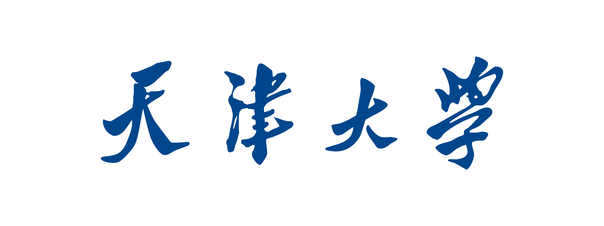
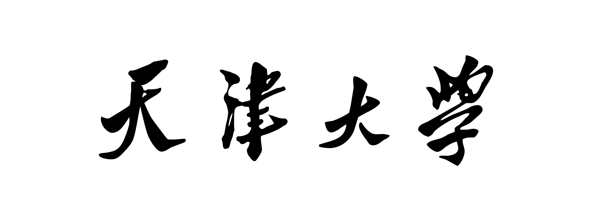
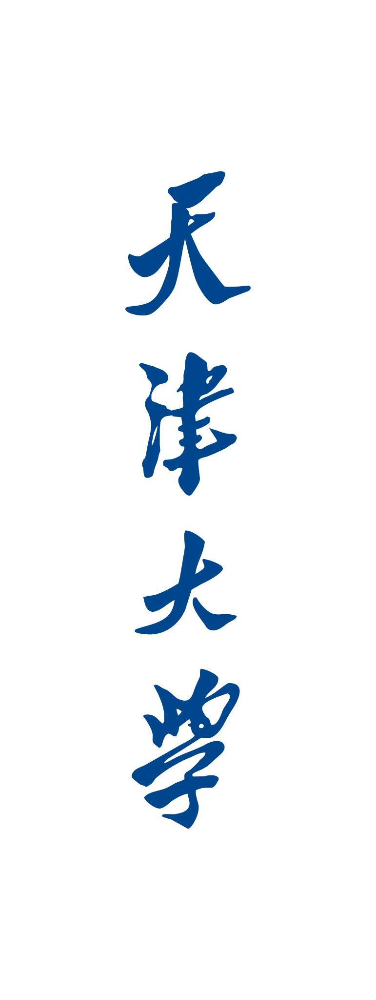
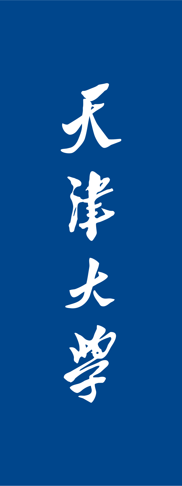
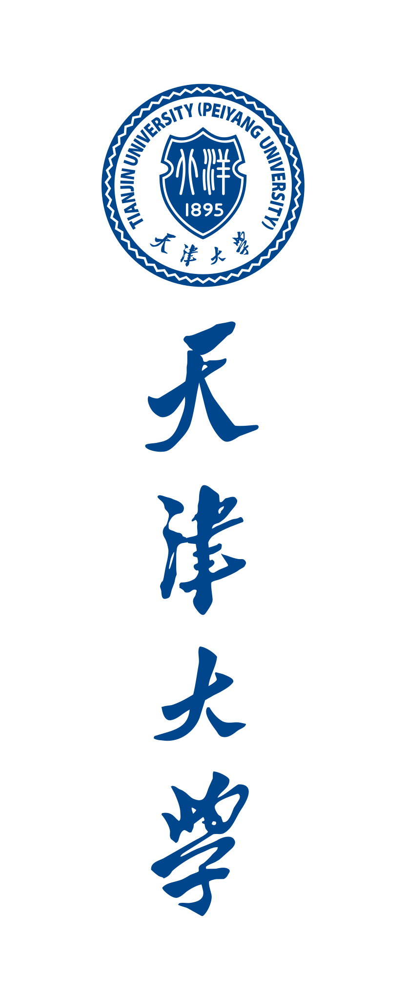
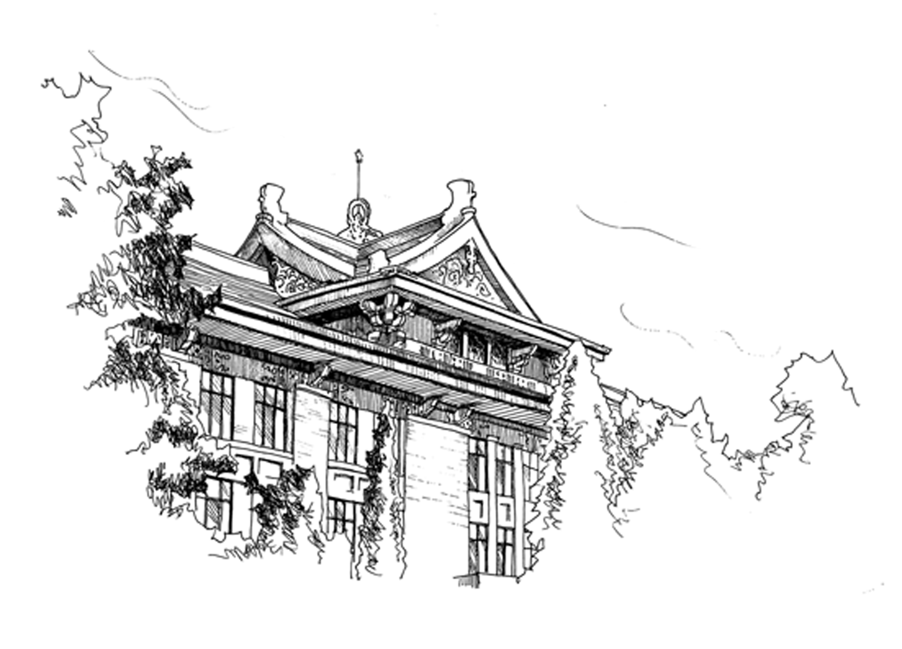
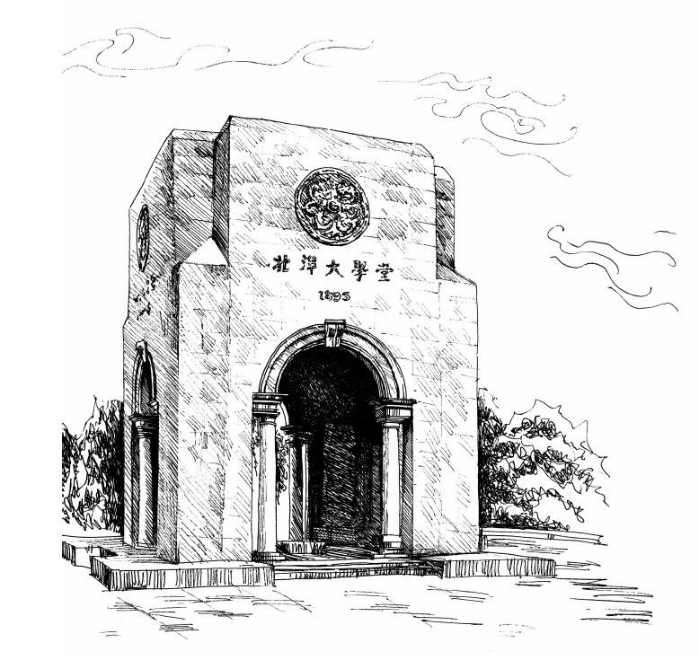

# 天津大学视觉形象识别系统

为更便捷、规范地使用我校标识，本项目在天津大学视觉形象识别手册的基础上，进行了图形、文字的校正工作，并整理了完整的使用版本。

> [!NOTE]
> 本项目非天津大学官方项目，如有问题请以官方为准。图形标志和字体标志的版权归天津大学所有。

## 快速使用

### 校徽（填充）

|格式|北洋蓝/白 |白/北洋蓝 |北洋蓝/透明 |
|:--:|:--:|:--:|:--:|
|校徽|  |  |  |
|校徽校标|  |  |  |
|校徽校标（纵向）|  |  |  |
|校徽校标（文字纵向）|  |  |  |
|校徽校标（中文）|  |  |  |
|校徽校标（中文纵向）|  |  |  |
|校徽校标（英文）|  |  |  |
|校徽校标（英文纵向）|  |  |  |
|北洋盾（边框）|  |N/A|  |
|北洋盾（填充）|  |N/A|  |

### 校标（填充）

|格式|北洋蓝/白 |白/北洋蓝 |北洋蓝/透明 |黑/白 |
|:--:|:--:|:--:|:--:|:--:|
|校标|  |  |  |  |
|校标（中文）|  |  |  |  |
|校标（英文）|  |  |  |  |
|校标（中文，纵向）|  |  |  |  |
|校标（英文，纵向）|  |  |  |  |

### 校徽（独立区域）

|格式|北洋蓝/白 |白/北洋蓝 |北洋蓝/透明 |
|:--:|:--:|:--:|:--:|
|校徽|  |  |  |
|校徽校标|  |  |  |
|校徽校标（纵向）|  |  |  |
|校徽校标（文字纵向）|  |  |  |
|校徽校标（中文）|  |  |  |
|校徽校标（中文纵向）|  |  |  |
|校徽校标（英文）|  |  |  |
|校徽校标（英文纵向）|  |  |  |

### 校标（独立区域）

|格式|北洋蓝/白 |白/北洋蓝 |北洋蓝/透明 |黑/白 |
|:--:|:--:|:--:|:--:|:--:|
|校标（中文）|  |  |  |  |
|校标（英文）|  |  |  |  |
|校标（中文，纵向）|  |  |  |  |
|校标（英文，纵向）|  |  |  |  |

## 规范使用

此节内容为官方手册中推荐的天津大学标志形象规范用法。

### 基础元素

#### 图形标志

图形标志   

图形标志反白图   

#### 字体标志

横式中文字体标志   

横式英文字体标志   

横式中文字体标志反白图   

横式英文字体标志反白图   

横式中文字体标志黑白图   

横式英文字体标志黑白图   

纵式中文字体标志   

纵式英文字体标志   

纵式中文字体标志反白图   

纵式英文字体标志反白图   

### 标准组合

#### 图形标志与中英文字体标志标准组合

图形标志与横向中英文字体标志横向组合   

图形标志与横向中英文字体标志横向组合反白图   

图形标志与横向中英文字体标志纵向组合   

图形标志与横向中英文字体标志纵向组合反白图   

图形标志与纵向中英文字体标志纵向组合   

图形标志与纵向中英文字体标志纵向组合反白图   

#### 图形标志与中文字体标志标准组合

图形标志与中文字体标志横向组合   

图形标志与中文字体标志横向组合反白图   

图形标志与中文字体标志纵向组合   

图形标志与中文字体标志纵向组合反白图   

#### 图形标志与英文字体标志标准组合

图形标志与英文字体标志横向组合   

图形标志与英文字体标志横向组合反白图   

图形标志与英文字体标志纵向组合   

图形标志与英文字体标志纵向组合反白图   

### 标准色彩

#### 基本色

|颜色|CMYK|PANTONE®|RGB|HEX|
|:--:|:--:|:--:|:--:|:--:|
|| C100M60Y0K30|PANTONE 2955 C[^1]|R0G70B140|`#00468c`|
||C0M0Y0K0|PANTONE Trans. White CV|R255G255B255|`#ffffff`|

[^1]: “PANTONE 2955 C” 应为 [《天津大学视觉形象识别手册》（2011 年）](https://www.tju.edu.cn/system/_content/download.jsp?urltype=news.DownloadAttachUrl&owner=1451525903&wbfileid=3758861) 中采用的北洋蓝 ，现已弃用。[《天津大学视觉形象识别系统(TU VI)手册》（2012 年）](https://f.tju.edu.cn/tp_up/download?path=uploadfiles/news/info/332947607552.pdf&name=%E5%A4%A9%E6%B4%A5%E5%A4%A7%E5%AD%A6%E8%A7%86%E8%A7%89%E5%BD%A2%E8%B1%A1%E8%AF%86%E5%88%AB%E7%B3%BB%E7%BB%9F(TU%20VI)%E6%89%8B%E5%86%8C.pdf) 中更新北洋蓝为  但并未修改 PANTONE® 颜色，因此此处 “PANTONE 2955 C” 不准确。

> [!NOTE]
> [《天津大学视觉形象识别手册》（2011 年）](https://www.tju.edu.cn/system/_content/download.jsp?urltype=news.DownloadAttachUrl&owner=1451525903&wbfileid=3758861) 中采用的北洋蓝  和  现已弃用。

#### 辅助色

|颜色|CMYK|RGB|HEX|
|:--:|:--:|:--:|:--:|
||C0M25Y100K0|R255G200B0|`#ffc800`|
||C50M100Y80K0|R150G40B0|`#962800`|
||C0M50Y100K60|R125G80B20|`#7d5014`|
||C100M0Y100K50|R0G90B30|`#005a1e`|

> [!NOTE]
> [《天津大学视觉形象识别手册》（2011 年）](https://www.tju.edu.cn/system/_content/download.jsp?urltype=news.DownloadAttachUrl&owner=1451525903&wbfileid=3758861) 中采用的辅助色金黄  现已弃用。

### 辅助图形

#### 辅助图形

北洋盾（边框）   

北洋盾（填充）   

主楼 

北洋大学堂 

## 参考

- [天津大学视觉形象识别系统(TU VI)手册（2012 年）](https://f.tju.edu.cn/tp_up/download?path=uploadfiles/news/info/332947607552.pdf&name=%E5%A4%A9%E6%B4%A5%E5%A4%A7%E5%AD%A6%E8%A7%86%E8%A7%89%E5%BD%A2%E8%B1%A1%E8%AF%86%E5%88%AB%E7%B3%BB%E7%BB%9F(TU%20VI)%E6%89%8B%E5%86%8C.pdf)
- [天津大学视觉形象识别手册（2011 年）](https://www.tju.edu.cn/system/_content/download.jsp?urltype=news.DownloadAttachUrl&owner=1451525903&wbfileid=3758861)
- [天大标识](https://www.tju.edu.cn/tdgk/tdbs.htm)
- [天津大学举行 2012 年第三次信息发布会](https://xxgkw.tju.edu.cn/xxfbh/201209/t20120917_159930.htm)

## 相关项目

- [中国双一流大学视觉形象识别系统](https://github.com/wanzhenchn/Visual_Identity_System_Chinese_University)
- [西安电子科技大学校徽](https://github.com/note286/xdulogo)
- [东南大学校徽](https://github.com/seumxc/SEU-Logo)
- [重庆大学视觉标识素材包](https://github.com/CQUtug/CQULogo)
- [中国科学技术大学视觉识别素材包](https://github.com/ustctug/ustclogo)
